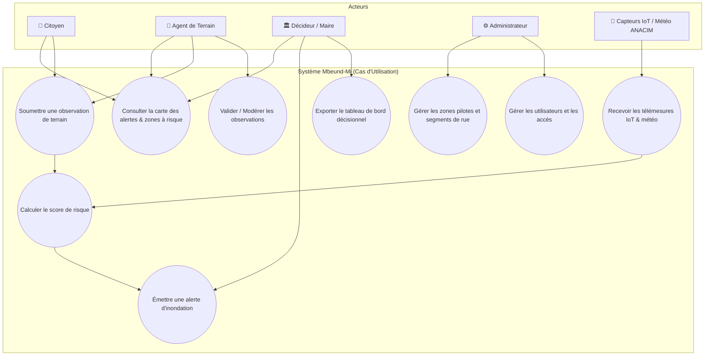
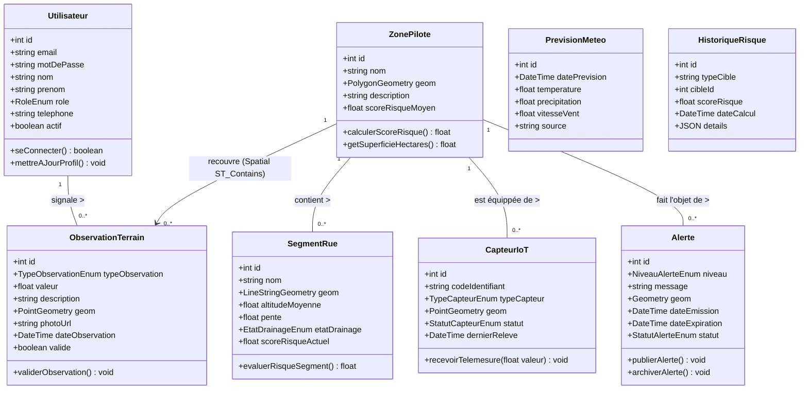
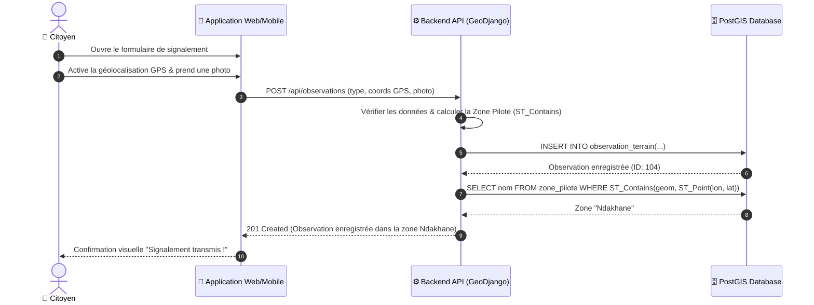
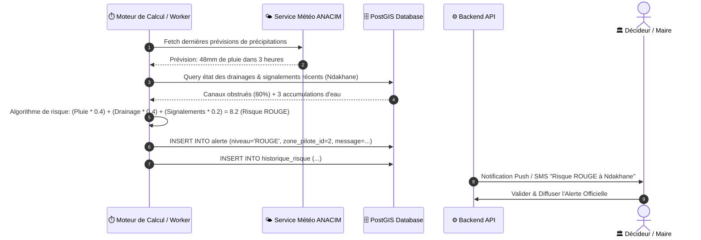
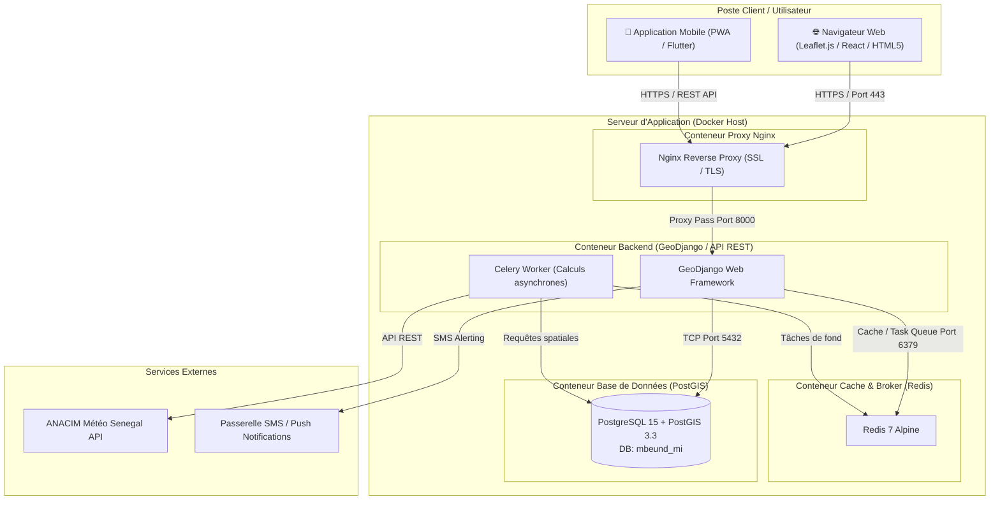

# Dossier de Modélisation UML — PFE Mbeund-Mi

## Plateforme de prévention et de gestion des inondations (Dakar, Thiaroye-sur-Mer)

Ce document rassemble l'ensemble des **diagrammes UML** nécessaires pour la rédaction du mémoire et la soutenance de votre **Projet de Fin d'Études (PFE)**.

Tous les diagrammes sont rédigés en syntaxe **Mermaid**, permettant une intégration directe dans Markdown, GitHub, Notion ou leur exportation sous forme d'images haute résolution pour Microsoft Word / LaTeX.

---

## 1. 🎯 Diagramme des Cas d'Utilisation (UML Use Case)

Ce diagramme identifie les différents acteurs du système et leurs interactions avec la plateforme **Mbeund-Mi**.

### Acteurs du Système
- **Citoyen / Habitant de Thiaroye** : Signale les risques sur le terrain et consulte la carte des alertes.
- **Agent de Terrain** : Effectue des vérifications, valide les observations citoyennes et relève l'état des infrastructures de drainage.
- **Décideur / Autorité Municipale** : Visualise les tableaux de bord décisionnels et valide l'émission des alertes officielles.
- **Administrateur Système** : Gère les comptes utilisateurs, paramètre les zones pilotes et supervise les capteurs IoT.
- **Système Externe (ANACIM / Capteurs IoT)** : Fournit automatiquement les données météorologiques et les télémesures de niveau d'eau.

---

## 2. 🧱 Diagramme de Classes UML (UML Class Diagram)

Le diagramme de classes représente le modèle statique orienté objet du système, incluant les attributs métiers, les types géospatiaux (PostGIS/GeoDjango) et les méthodes principales.

---

## 3. 🔄 Diagrammes de Séquence UML (UML Sequence Diagrams)

### Scénario A : Signalement citoyen d'une accumulation d'eau sur le terrain

Ce diagramme détaille le flux d'échange lors de la soumission d'une alerte citoyenne géolocalisée.

---

### Scénario B : Calcul automatique du risque & Déclenchement d'alerte

Ce diagramme montre comment le système agrège les métadonnées (IoT, météo, signalements) pour générer automatiquement une alerte d'inondation.

---

## 4. 🏗️ Diagramme de Déploiement UML (UML Deployment Diagram)

Ce diagramme illustre l'architecture physique et l'infrastructure d'hébergement basée sur des conteneurs **Docker**.

---

## 💡 Conseils pour l'intégration dans le Mémoire PFE

1. **Intégration Microsoft Word / Google Docs** :
   - Vous pouvez ouvrir ce fichier dans VS Code ou GitHub, et faire un clic droit sur chaque diagramme Mermaid pour l'exporter en **PNG / SVG**.
2. **Présentation orale / Soutenance** :
   - Utilisez le **Diagramme des Cas d'Utilisation** dans la phase *Analyse des Besoins*.
   - Utilisez le **Diagramme de Classes** et le **Diagramme de Déploiement** dans la phase *Conception & Architecture*.
